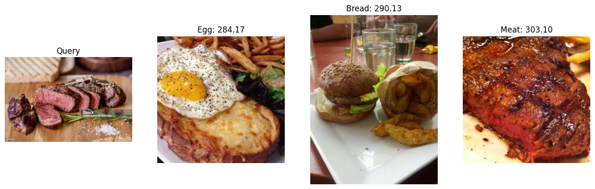

# chromadb_ViT_food

총 11종의 음식 이미지 분류를 위한 chromad 내 DINO-ViT-S/16 모델 적용 

   
## Object

DINO 방법을 사용하여 훈련된 ViT 모델로 224x224 픽셀의 해상도에서 ImageNet-1k 라는 대규모 이미지 컬렉션에 사전 학습된 변환기 인코더 모델입니다.
사전 훈련된 모델은 다운스트림 작업에 유용한 기능을 추출하는 데 사용할 수 있는 이미지의 내부 표현을 학습합니다.

11가지 주요 음식 카테고리로 분류된 16643개의 음식 이미지

   
## Dataset

- Food-11 image dataset

   
## Libraries used

- Transformers_DINO-ViT-S/16
- PIL_Image
- chromadb

   
## File explanation

   
## WorkFlow

   
## Result
