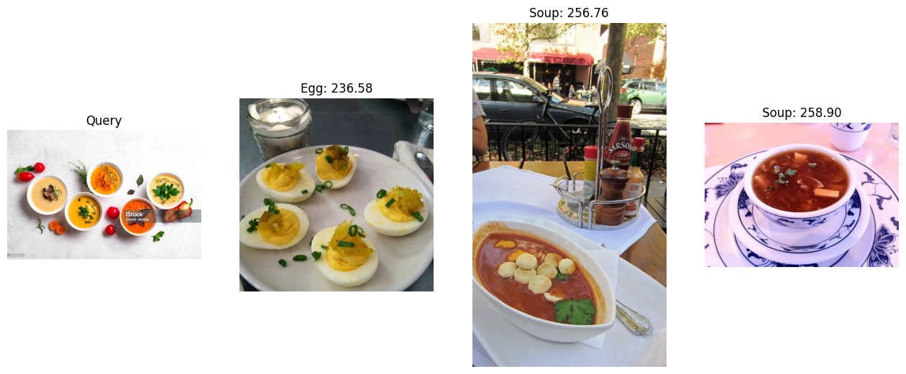

# chromadb_ViT_food

총 11종의 음식 이미지 분류를 위한 chromad 내 DINO-ViT-S/16 모델 적용 

   
## Object

   
## Dataset

- Food-11 image dataset

   
## Libraries used

- Transformers_DINO-ViT-S/16
- PIL_Image
- chromadb

   
## File explanation

   
## Version

   
## Result
